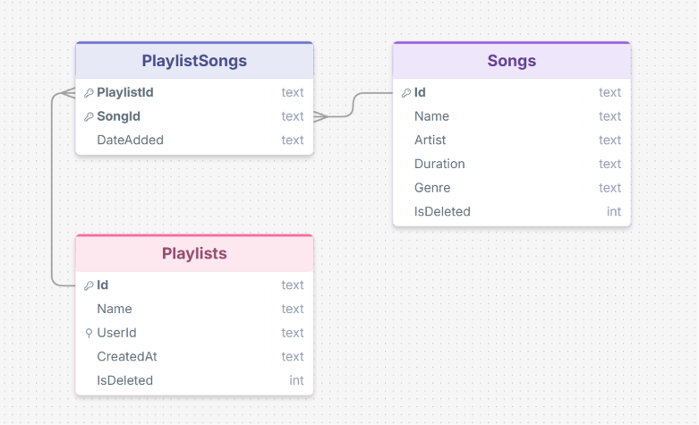

# Database Schema

This document describes the relational schema used by the Playlist Service API.  
The database is **SQLite**, managed via **Entity Framework Core** code-first migrations.  
Source of truth: `PlaylistService.Infrastructure/Migrations/`.

---

## Tables

### `Playlists`

Stores user-created playlists.

| Column | Type | Constraints | Notes |
|---|---|---|---|
| `Id` | `TEXT` (GUID) | PRIMARY KEY | Generated by the domain (`Guid.NewGuid()`) |
| `Name` | `TEXT` | NOT NULL | Display name chosen by the user |
| `UserId` | `TEXT` (GUID) | NOT NULL, INDEX | Identifies the owning user (no FK — auth is header-based) |
| `CreatedAt` | `TEXT` (DateTime) | NOT NULL | UTC timestamp set on creation |
| `IsDeleted` | `INTEGER` (bool) | NOT NULL, DEFAULT 0 | Soft-delete flag; EF global query filter excludes rows where `IsDeleted = 1` |

**Global query filter:** `WHERE IsDeleted = 0` is appended automatically by EF Core to every query against this table. Hard deletes are never performed.

---

### `Songs`

A catalogue of available songs. Populated by `DbSeeder` on startup (Development only).

| Column | Type | Constraints | Notes |
|---|---|---|---|
| `Id` | `TEXT` (GUID) | PRIMARY KEY | Generated by the domain |
| `Name` | `TEXT` | NOT NULL | Track title |
| `Artist` | `TEXT` | NOT NULL | Performing artist |
| `Duration` | `TEXT` (TimeSpan) | NOT NULL | Stored as ticks string by EF Core's SQLite provider |
| `Genre` | `TEXT` | NOT NULL | Genre label (e.g., "Rock", "Pop") |
| `IsDeleted` | `INTEGER` (bool) | NOT NULL, DEFAULT 0 | Soft-delete flag; same global query filter as `Playlists` |

---

### `PlaylistSongs`  *(join table)*

Many-to-many relationship between `Playlists` and `Songs`.

| Column | Type | Constraints | Notes |
|---|---|---|---|
| `PlaylistId` | `TEXT` (GUID) | PRIMARY KEY (composite), FOREIGN KEY → `Playlists.Id` | Cascade delete if playlist is hard-deleted |
| `SongId` | `TEXT` (GUID) | PRIMARY KEY (composite), FOREIGN KEY → `Songs.Id` | |
| `DateAdded` | `TEXT` (DateTime) | NOT NULL | UTC timestamp when the song was added to the playlist |

**Composite primary key:** `(PlaylistId, SongId)` — a song can appear in a playlist at most once.

---

## Entity Relationship Diagram

---

## Design Decisions

| Decision | Rationale |
|---|---|
| **Soft deletes** (`IsDeleted`) | Preserve referential integrity and support future undo/audit features. EF Core global query filters keep application code clean — deleted records are invisible without explicit `IgnoreQueryFilters()`. |
| **Composite PK on `PlaylistSongs`** | Enforces the business rule "a song may appear in a given playlist at most once" at the database level, removing the need for a separate surrogate key. |
| **No `Users` table** | The assessment scope does not include auth. `UserId` is accepted via HTTP header. Adding a `Users` table with FK constraints is a straightforward extension when auth is introduced. |
| **No `ON DELETE CASCADE`** | Because deletes are soft, no cascade is needed. The `IsDeleted` flag on `Playlists` makes the logical deletion self-contained. |
